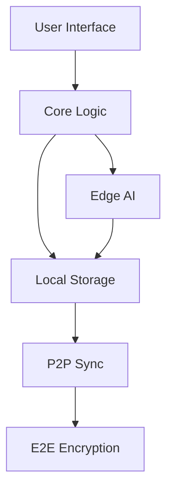

# erēmois Project Structure

```
eremois/
├── apps/                      # Application implementations
│   ├── desktop/              # Desktop app (Tauri-based)
│   │   ├── src-tauri/       # Rust-based backend
│   │   └── src/             # Frontend UI
│   ├── mobile/              # Mobile app (React Native)
│   │   ├── ios/
│   │   ├── android/
│   │   └── src/
│   └── web/                 # Progressive Web App (optional)
│
├── packages/                 # Shared core packages
│   ├── core/                # Core business logic
│   │   ├── timeline/        # Timeline management
│   │   ├── tasks/          # Task management
│   │   └── sync/           # P2P sync implementation
│   ├── ai/                  # Edge AI implementation
│   │   ├── models/         # ML models
│   │   ├── training/       # Local training logic
│   │   └── inference/      # Prediction & adaptation
│   ├── storage/            # Local storage implementation
│   │   ├── encrypted/      # Encryption layer
│   │   └── adapters/       # Storage adapters
│   └── ui/                 # Shared UI components
│       ├── timeline/       # Timeline visualizations
│       ├── components/     # Common components
│       └── themes/         # Theming system
│
├── tools/                   # Development & build tools
│   ├── ml-pipeline/        # ML model optimization
│   └── dev-utils/          # Development utilities
│
├── plugins/                 # Plugin system
│   ├── core/               # Plugin core
│   └── official/           # Official plugins
│
├── config/                  # Configuration
│   ├── eslint/             # ESLint configs
│   ├── typescript/         # TypeScript configs
│   └── jest/              # Test configs
│
└── docs/                    # Documentation
    ├── architecture/       # Architecture docs
    ├── api/               # API documentation
    ├── guides/            # User & dev guides
    └── ml/                # ML documentation
```

## Key Architectural Decisions

### 1. Privacy-First Architecture

- All sensitive data stored locally
- End-to-end encryption for optional sync
- No cloud dependencies
- Local-first operations

### 2. Edge AI Implementation

- TensorFlow.js/ONNX Runtime for edge
- Local model training & adaptation
- Efficient resource usage
- Privacy-preserving learning

### 3. Modular Core

- Shared business logic
- Platform-specific adaptations
- Plugin architecture
- Clear separation of concerns

### 4. Cross-Platform Strategy

- Tauri for desktop (performance)
- React Native for mobile
- Shared core logic
- Native optimizations where needed

### 5. Data Flow



## Package Dependencies

### Core Dependencies

- TensorFlow.js (AI)
- SQLite (Storage)
- Tauri (Desktop)
- React Native (Mobile)
- TypeScript (Development)

### Development Dependencies

- ESLint
- Jest
- TypeScript
- Prettier
- Husky

## Getting Started

1. Clone the repository
2. Install dependencies:
   ```bash
   npm install
   ```
3. Choose your target platform:

   ```bash
   # Desktop
   cd apps/desktop
   npm run dev

   # Mobile
   cd apps/mobile
   npm run ios # or android
   ```

## Development Guidelines

1. **Privacy First**: All features must work offline by default
2. **Edge Computing**: AI/ML must run locally
3. **Resource Efficiency**: Optimize for mobile devices
4. **Type Safety**: Use TypeScript strictly
5. **Testing**: Maintain high test coverage
